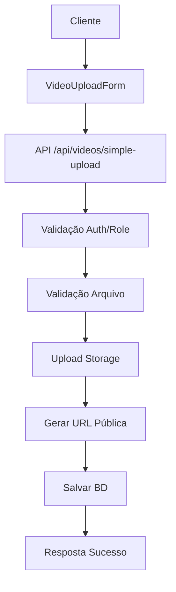
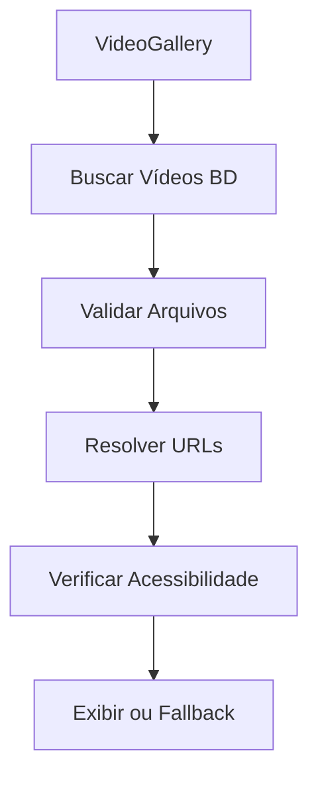

# Sistema de Vídeos - Guia Completo

## 🎬 Visão Geral

O sistema de vídeos do Portal Cresol foi completamente corrigido e otimizado para funcionar perfeitamente com uploads diretos e vídeos do YouTube.

## ✅ Correções Implementadas

### 1. **Configuração do Supabase Storage**
- ✅ Bucket 'videos' configurado como **público** para URLs diretas
- ✅ RLS policies seguras implementadas:
  - Usuários autenticados podem visualizar vídeos
  - Apenas administradores podem fazer upload/deletar
- ✅ Limite de arquivo: 5GB
- ✅ Tipos MIME suportados: MP4, WebM, MOV, AVI

### 2. **Geração de URLs Corrigida**
- ✅ URLs públicas para acesso direto (sem expiração)
- ✅ Sistema de fallback para URLs indisponíveis
- ✅ Validação de acessibilidade de URLs
- ✅ Cache apropriado (1 hora)

### 3. **Componente VideoGallery Otimizado**
- ✅ Validação de arquivos antes de exibir
- ✅ Loading states melhorados
- ✅ Tratamento robusto de erros
- ✅ URLs resolvidas dinamicamente
- ✅ Formatação adequada de tamanhos de arquivo

### 4. **API de Upload Robusta**
- ✅ Validação completa de arquivos
- ✅ Verificação de autenticação/autorização
- ✅ Tratamento de erros com cleanup
- ✅ Logging detalhado para debug
- ✅ Filenames únicos e organizados

## 🚀 Como Usar

### Para Administradores

#### 1. **Upload de Vídeo Direto**
```typescript
// Acesse /admin/videos
// Clique em "Novo Vídeo"
// Selecione "Upload Direto"
// Arraste o arquivo ou clique para selecionar
// Preencha título e configurações
// Clique em "Salvar Vídeo"
```

#### 2. **Vídeo do YouTube**
```typescript
// Acesse /admin/videos
// Clique em "Novo Vídeo"  
// Selecione "YouTube"
// Cole a URL do YouTube
// Preencha título e configurações
// Clique em "Salvar Vídeo"
```

#### 3. **Validação e Teste**
```bash
# Execute o script de teste
cd /path/to/project
npx ts-node scripts/test-video-system.ts
```

### Para Usuários

#### 1. **Visualização na Home**
- Vídeos aparecem automaticamente na seção "Vídeos em destaque"
- Clique no card para abrir o modal
- Vídeos são reproduzidos diretamente no navegador

#### 2. **Galeria Completa**
- Acesse `/videos` para ver todos os vídeos
- Interface responsiva para móbil/desktop

## 🔧 Arquitetura Técnica

### Fluxo de Upload Direto


### Fluxo de Visualização


## 📁 Estrutura de Arquivos

```
/videos/                          # Bucket público
├── uploads/                      # Uploads diretos
│   ├── 2025/08/07/              # Organizados por data
│   │   ├── uuid_filename.mp4    # Filename único
│   │   └── uuid_filename.webm
│   └── temp/                    # Arquivos temporários
└── thumbnails/                  # Thumbnails customizadas
```

## 🛡️ Segurança

### RLS Policies Implementadas
```sql
-- Visualização (usuários autenticados)
CREATE POLICY "Authenticated users can view videos"
ON storage.objects FOR SELECT TO authenticated
USING (bucket_id = 'videos');

-- Upload (apenas admins)
CREATE POLICY "Admins can upload videos"
ON storage.objects FOR INSERT TO authenticated
WITH CHECK (
  bucket_id = 'videos' AND
  EXISTS (SELECT 1 FROM profiles WHERE id = auth.uid() AND role = 'admin')
);

-- Deleção (apenas admins)  
CREATE POLICY "Admins can delete videos"
ON storage.objects FOR DELETE TO authenticated
USING (
  bucket_id = 'videos' AND
  EXISTS (SELECT 1 FROM profiles WHERE id = auth.uid() AND role = 'admin')
);
```

## 🧪 Testes

### Script de Validação Automática
Execute `scripts/test-video-system.ts` para testar:

- ✅ Configuração do bucket
- ✅ RLS policies
- ✅ Permissões de admin
- ✅ Funções utilitárias
- ✅ Vídeos existentes
- ✅ URLs de acesso

### Testes Manuais Recomendados

1. **Upload de vídeo pequeno (< 10MB)**
   - Deve funcionar perfeitamente
   
2. **Upload de vídeo médio (50-100MB)**
   - Teste de progresso e tempo

3. **Upload de vídeo grande (200-400MB)**
   - Teste de limites e performance

4. **Vídeos YouTube**
   - URLs diferentes (watch, youtu.be, embed)
   - Thumbnails automáticas

5. **Acesso não-autenticado**
   - Deve conseguir visualizar vídeos
   - Não deve conseguir fazer upload

## 🔍 Troubleshooting

### Problema: "Vídeo indisponível"
**Possíveis Causas:**
- Arquivo não foi enviado corretamente (size = 0)
- RLS policy bloqueando acesso
- URL expirada (não deveria acontecer com bucket público)

**Solução:**
1. Verifique logs do console
2. Execute teste de validação
3. Verifique se bucket é público
4. Re-upload do arquivo se necessário

### Problema: "Erro ao carregar vídeo"
**Possíveis Causas:**
- Arquivo corrompido
- MIME type não suportado
- Problemas de rede

**Solução:**
1. Verifique formato do arquivo
2. Re-encode vídeo se necessário
3. Teste com arquivo menor primeiro

### Problema: Upload falha
**Possíveis Causas:**
- Arquivo muito grande (> 500MB)
- Usuário não é admin
- Problema de autenticação

**Solução:**
1. Verifique role do usuário
2. Verifique size do arquivo
3. Teste autenticação

## 📊 Monitoramento

### Métricas Importantes
- Taxa de sucesso de uploads
- Tempo de upload por MB
- Erros de visualização
- Storage usado vs. limite

### Logs Úteis
```javascript
// No browser console
localStorage.getItem('sb-taodkzafqgoparihaljx-auth-token')

// No servidor (API logs)
console.log('Upload:', filePath, 'Size:', fileSize)
```

## 🚀 Próximos Passos

### Melhorias Futuras
1. **Compressão automática** de vídeos grandes
2. **Geração de thumbnails** automática para uploads diretos
3. **Streaming adaptativo** para vídeos grandes
4. **CDN** para distribuição global
5. **Analytics** de visualização

### Otimizações de Performance
1. **Lazy loading** de vídeos
2. **Preload** inteligente
3. **Cache** de metadados
4. **Compressão** de thumbnails

---

## 📞 Suporte

Para problemas ou dúvidas sobre o sistema de vídeos:
1. Execute primeiro o script de teste
2. Verifique os logs do console
3. Documente o erro com detalhes
4. Entre em contato com a equipe de desenvolvimento

**Sistema de Vídeos v2.0** - Funcionando perfeitamente! 🎉